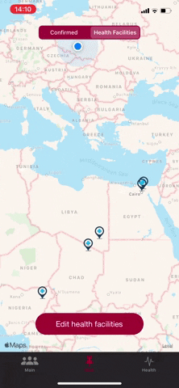

# Coronavirus tracker
Simple app to track the spread of COVID-19 around the world. It also helps to calculate probability of infection and find healthcare facilities.

## Table of contents
* [General info](#general-info)
* [Screenshots](#screenshots)
* [Technologies](#technologies)
* [Features](#features)
* [Setup](#setup)
* [Contact](#contact)
* [License](#license)


## General info

The application was written in early February 2020 as a result of the spreading SARS-CoV2 virus. Its purpose was to present virus outbreaks on the map. Data was downloaded from [Coronavirus Tracker Api](https://github.com/ExpDev07/coronavirus-tracker-api).

It also has the task of educating the user on how to avoid infection and how to identify them.
Users have the option of placing health facilities on the map where infected SARS-CoV2 can find help.

The app was rejected from publication due to Apple Policy.

## Screenshots

<!--  -->
## Technologies/Frameworks/Design Patterns
- [x] MVVM
- [x] Networking With URLSession
- [x] Firebase Firestore for healthcare facilities
- [x] JSON parsing using `Codable`
- [x] Dependency Injection
- [x] `MapKit`, `UIKit`, `StoreKit`
- [x] Localization - Polish, English, Italian

## Features
- [x] Browse statistics by country
- [x] Explore COVID outbreaks on the map
- [x] Find healthcare facilities and add one on the map

   


- [x] Learn how to avoid infection
- [x] Take the test for likelihood of being infected
- [x] Share your score to the friends

 


## Setup
1. Clone project
2. Install [CocoaPods](https://guides.cocoapods.org/using/getting-started.html)
2. Open Terminal and run `pod install`
3. In order for Firebase to work, create a [new project](https://console.firebase.google.com/u/0/) for your application.
4. Download ```GoogleService-Info.plist``` from your newly created Firebase project and replace it with the old one.
6. Create [Firebase Firestore](https://firebase.google.com/docs/firestore/quickstart)
7. Set Database rules to:
```
{
  "rules": {
     ".read": true,
     ".write": true     
  }
}
```

## Contact
Created by [@tymoteusz.pasieka](http://wheelo.com.pl/) - feel free to contact me!

## License
MIT License

Copyright 2020 Tymoteusz Pasieka

Permission is hereby granted, free of charge, to any person obtaining a copy of this software and associated documentation files (the "Software"), to deal in the Software without restriction, including without limitation the rights to use, copy, modify, merge, publish, distribute, sublicense, and/or sell copies of the Software, and to permit persons to whom the Software is furnished to do so, subject to the following conditions:

The above copyright notice and this permission notice shall be included in all copies or substantial portions of the Software.

THE SOFTWARE IS PROVIDED "AS IS", WITHOUT WARRANTY OF ANY KIND, EXPRESS OR IMPLIED, INCLUDING BUT NOT LIMITED TO THE WARRANTIES OF MERCHANTABILITY, FITNESS FOR A PARTICULAR PURPOSE AND NONINFRINGEMENT. IN NO EVENT SHALL THE AUTHORS OR COPYRIGHT HOLDERS BE LIABLE FOR ANY CLAIM, DAMAGES OR OTHER LIABILITY, WHETHER IN AN ACTION OF CONTRACT, TORT OR OTHERWISE, ARISING FROM, OUT OF OR IN CONNECTION WITH THE SOFTWARE OR THE USE OR OTHER DEALINGS IN THE SOFTWARE.
